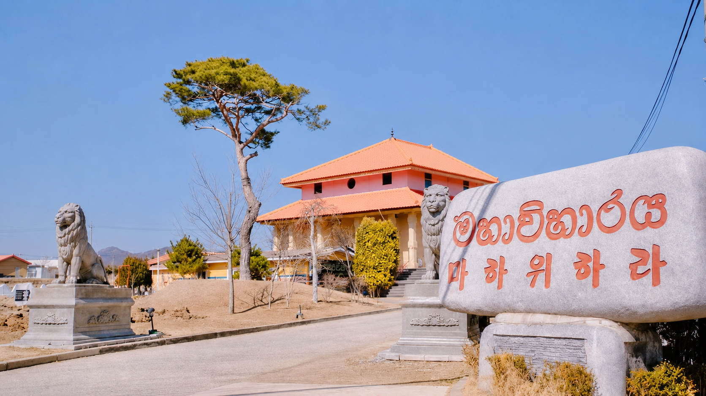

# Korea Sri Lanka Maha Viharaya – 4 Page Website Build Instructions

## Project Goal

Create a premium, modern, responsive 4-page official website for **Korea Sri Lanka Maha Viharaya** using only:

- HTML
- CSS
- JavaScript
- Tailwind CSS via CDN

The website must work as a **static website**.  
The user should be able to open the website by simply **double-clicking `index.html`** without needing React, Node.js, npm, Vite, or any backend.

The website should look premium, spiritual, official, peaceful, and modern.

---

## Website Name

**Korea Sri Lanka Maha Viharaya**

Sinhala name:

**කොරියා ශ්‍රී ලංකා මහා විහාරය**

---

## Main Website Purpose

This website is for the Sri Lankan Buddhist temple located in South Korea.  
It should represent the temple as a spiritual, cultural, and community center for Sri Lankans living in Korea.

The website should help visitors understand:

- What the temple is
- Its religious and cultural importance
- Upcoming events and programs
- Community activities
- Contact and location information

---

## Required Pages

Create a complete 4-page website with these pages:

1. `index.html` – Home Page
2. `about.html` – About the Temple
3. `events.html` – Events & Programs
4. `contact.html` – Contact & Location

Also create:

5. `style.css` – Custom CSS
6. `script.js` – JavaScript interactions
7. `assets/` folder – For images and future media

The project structure should be:

```txt
korea-sri-lanka-maha-viharaya/
│
├── index.html
├── about.html
├── events.html
├── contact.html
├── style.css
├── script.js
│
└── assets/
    ├── temple-cover.jpg
    ├── temple-about.jpg
    ├── event-poson.jpg
    └── gallery/
```

Use placeholder images if real images are not available, but keep the code ready for replacing them with real images.

---

## Technical Requirements

### Very Important

Do not use:

- React
- Next.js
- Vue
- Angular
- Node.js
- npm
- Vite
- Backend server
- Database

Use only:

- HTML files
- CSS file
- JavaScript file
- Tailwind CSS CDN

The website must run by double-clicking:

```txt
index.html
```

All navigation links must work locally.

Example:

```html
<a href="about.html">About</a>
<a href="events.html">Events</a>
<a href="contact.html">Contact</a>
```

Do not use routes like `/about` or `/events`.

---

## Tailwind CSS Setup

Use Tailwind CSS CDN in every HTML page:

```html
<script src="https://cdn.tailwindcss.com"></script>
```

Also link custom CSS:

```html
<link rel="stylesheet" href="style.css">
```

Also link JavaScript:

```html
<script src="script.js" defer></script>
```

---

## Design Style

The design should be:

- Premium
- Modern
- Official
- Spiritual
- Peaceful
- Elegant
- Mobile responsive
- Clean and professional

Use this visual feeling:

- Buddhist temple atmosphere
- Warm golden light
- White and soft cream backgrounds
- Deep maroon accents
- Gold highlights
- Dark elegant text
- Smooth shadows
- Rounded corners
- Large hero sections
- Elegant cards
- Modern navigation bar
- Smooth scroll animation
- Premium footer

---

## Color Palette

Use these colors:

```txt
Deep Maroon: #6B1E1E
Temple Gold: #D4AF37
Warm Cream: #FFF8E7
Soft White: #FFFFFF
Dark Charcoal: #1F2937
Muted Brown: #7C5C3B
Light Gold: #F5E6B3
```

Tailwind-friendly color usage:

- Background: `bg-[#FFF8E7]`
- Primary: `bg-[#6B1E1E]`
- Gold text: `text-[#D4AF37]`
- Dark text: `text-gray-800`
- Cards: `bg-white/90`
- Borders: `border-[#D4AF37]/30`

---

## Font Style

Use Google Fonts:

- English: `Poppins`
- Sinhala: `Noto Sans Sinhala`

Add this to every page head:

```html
<link href="https://fonts.googleapis.com/css2?family=Noto+Sans+Sinhala:wght@400;500;600;700&family=Poppins:wght@400;500;600;700;800&display=swap" rel="stylesheet">
```

CSS:

```css
body {
  font-family: 'Poppins', 'Noto Sans Sinhala', sans-serif;
}
```

---

## Common Header / Navigation

Every page must include the same responsive navigation bar.

Navigation items:

- Home
- About
- Events
- Contact

Header design:

- Sticky top navigation
- White or cream background with blur effect
- Temple name on left
- Navigation menu on right
- Mobile hamburger menu
- Gold accent button: “Visit Temple”

Logo text:

```txt
Korea Sri Lanka Maha Viharaya
කොරියා ශ්‍රී ලංකා මහා විහාරය
```

Mobile menu must open and close using JavaScript.

---

## Common Footer

Every page must include the same premium footer.

Footer sections:

1. Temple name and short description
2. Quick links
3. Programs
4. Contact information

Footer text:

```txt
Korea Sri Lanka Maha Viharaya is a spiritual, cultural, and community center for Sri Lankans living in South Korea.
```

Programs list:

- Dhamma Sermons
- Religious Observances
- Cultural Events
- Community Gatherings
- Youth & Family Programs

Footer bottom:

```txt
© 2026 Korea Sri Lanka Maha Viharaya. All Rights Reserved.
```

---

# Page 1: Home Page – `index.html`

## Home Page Goal

Create a strong premium first impression.

## Sections Required

### 1. Hero Section

Full-width hero section with temple background image.

Use:

```txt
assets/temple-cover.jpg
```

If image is missing, use gradient background.

Hero text:

```txt
Welcome to Korea Sri Lanka Maha Viharaya
```

Sinhala text:

```txt
කොරියා ශ්‍රී ලංකා මහා විහාරයට සාදරයෙන් පිළිගනිමු
```

Subtitle:

```txt
A spiritual home for faith, culture, and community in South Korea.
```

Buttons:

- Explore Temple
- Upcoming Events

Hero design:

- Dark overlay on image
- Golden light gradient
- Large title
- Smooth fade-in animation
- Premium button style

---

### 2. Intro Section

Title:

```txt
A Sacred Sri Lankan Buddhist Temple in Korea
```

Content:

```txt
Korea Sri Lanka Maha Viharaya is a Sri Lankan Buddhist temple in South Korea, serving as a spiritual, cultural, and community center for Sri Lankans living in Korea. Rooted in the teachings of Buddhism, the temple provides a peaceful space for religious observances, cultural events, community gatherings, and the preservation of Sri Lankan Buddhist heritage.
```

Add 3 highlight cards:

1. Spiritual Guidance
2. Cultural Heritage
3. Community Unity

---

### 3. About Preview Section

Use two-column layout:

Left: Image  
Right: Text

Title:

```txt
Preserving Faith and Culture Beyond Borders
```

Text:

```txt
The temple brings together devotees, families, students, workers, and well-wishers to continue Sri Lankan Buddhist traditions while building unity in the Sri Lankan community in Korea.
```

Button:

```txt
Learn More
```

Link to:

```txt
about.html
```

---

### 4. Event Highlight Section

Title:

```txt
Upcoming Temple Programs
```

Cards:

1. Poson Program
2. Dhamma Sermon
3. Community Gathering

Each card should include:

- Date
- Short description
- Button: View Events

---

### 5. Call-to-Action Section

Text:

```txt
Join us in preserving Buddhist values, Sri Lankan culture, and community harmony in South Korea.
```

Button:

```txt
Contact Us
```

Link to:

```txt
contact.html
```

---

# Page 2: About Page – `about.html`

## About Page Goal

Explain the identity, purpose, and value of the temple.

## Sections Required

### 1. Page Header

Title:

```txt
About Korea Sri Lanka Maha Viharaya
```

Subtitle:

```txt
A sacred place of worship, culture, and community for Sri Lankans in South Korea.
```

---

### 2. About Description

Use this content:

```txt
Korea Sri Lanka Maha Viharaya is a Sri Lankan Buddhist temple in South Korea dedicated to supporting the spiritual and cultural needs of the Sri Lankan community. The temple serves as a peaceful place for worship, meditation, Dhamma learning, religious observances, and community connection.
```

```txt
Through Buddhist teachings and Sri Lankan traditions, the temple helps devotees maintain their religious identity while living abroad. It also creates a welcoming environment for families, students, workers, and friends to gather, learn, and participate in meaningful activities.
```

---

### 3. Mission Section

Mission title:

```txt
Our Mission
```

Mission text:

```txt
To preserve and promote Buddhist values, Sri Lankan cultural heritage, and community unity among Sri Lankans living in South Korea.
```

---

### 4. Vision Section

Vision title:

```txt
Our Vision
```

Vision text:

```txt
To become a peaceful spiritual and cultural center that connects faith, tradition, and community across generations.
```

---

### 5. Values Section

Create 4 premium cards:

1. Faith
2. Compassion
3. Unity
4. Heritage

Descriptions:

Faith:

```txt
Strengthening spiritual life through Buddhist teachings and religious practices.
```

Compassion:

```txt
Encouraging kindness, respect, and service to others.
```

Unity:

```txt
Bringing the Sri Lankan community together in South Korea.
```

Heritage:

```txt
Preserving Sri Lankan Buddhist culture, traditions, and identity.
```

---

### 6. Community Section

Title:

```txt
A Home for the Sri Lankan Community
```

Text:

```txt
The temple is more than a place of worship. It is a community home where people gather for religious ceremonies, cultural events, educational programs, and social support.
```

Add image section with elegant overlay.

---

# Page 3: Events Page – `events.html`

## Events Page Goal

Show religious programs, cultural events, and community activities.

## Sections Required

### 1. Page Header

Title:

```txt
Events & Programs
```

Subtitle:

```txt
Religious, cultural, and community activities organized by Korea Sri Lanka Maha Viharaya.
```

---

### 2. Featured Event Section

Create a large highlighted event card.

Title:

```txt
Poson Program & Community Gathering
```

Date:

```txt
June 28, 2026
```

Venue:

```txt
Korea Sri Lanka Maha Viharaya, Asan
```

Description:

```txt
A special Poson program bringing together devotees and the Sri Lankan community in Korea for religious observances, cultural reflection, and community fellowship.
```

Program items:

- Dhamma Sermon
- Bhakthi Gee
- Dansala
- Dahasak Pahan Poojawa
- Community Gathering

---

### 3. Regular Programs Section

Title:

```txt
Regular Temple Programs
```

Create cards for:

1. Weekly Dhamma Sermons
2. Meditation Programs
3. Full Moon Poya Observances
4. Cultural Celebrations
5. Youth & Family Activities
6. Community Support Programs

---

### 4. Event Gallery Preview

Create a modern gallery layout using placeholder images.

Title:

```txt
Moments from Our Community
```

Use image placeholders:

```txt
assets/gallery/gallery-1.jpg
assets/gallery/gallery-2.jpg
assets/gallery/gallery-3.jpg
assets/gallery/gallery-4.jpg
```

If images are missing, use gradient blocks.

---

### 5. CTA Section

Text:

```txt
Stay connected with upcoming temple programs and community events.
```

Button:

```txt
Contact Temple
```

---

# Page 4: Contact Page – `contact.html`

## Contact Page Goal

Provide contact details and location.

## Sections Required

### 1. Page Header

Title:

```txt
Contact & Location
```

Subtitle:

```txt
Connect with Korea Sri Lanka Maha Viharaya for temple programs, visits, and community activities.
```

---

### 2. Contact Cards

Create 3 cards:

1. Location
2. Phone / WhatsApp
3. Email / Social Media

Use placeholder details:

Location:

```txt
Asan-si, Chungcheongnam-do, South Korea
```

Phone:

```txt
Add temple contact number here
```

Email:

```txt
Add official email address here
```

Social:

```txt
Facebook / YouTube links can be added here
```

---

### 3. Contact Form

Create a static contact form.

Fields:

- Full Name
- Email Address
- Phone Number
- Message

Button:

```txt
Send Message
```

Since this is a static website, form submission should not send to a backend.  
Use JavaScript to show a friendly message:

```txt
Thank you for contacting Korea Sri Lanka Maha Viharaya. We will get back to you soon.
```

Do not use backend or database.

---

### 4. Map Section

Add a Google Maps placeholder section.

Text:

```txt
Google Map location can be embedded here.
```

Use a beautiful placeholder card.

---

### 5. Visit Information

Title:

```txt
Plan Your Visit
```

Text:

```txt
Visitors are welcome to join religious programs, community gatherings, and cultural activities. Please contact the temple before visiting for event schedules and updated information.
```

---

# JavaScript Requirements – `script.js`

Add JavaScript for:

1. Mobile menu open/close
2. Smooth scroll behavior
3. Navbar shadow on scroll
4. Contact form success message
5. Simple reveal animation on scroll

Example behavior:

- Hamburger button toggles mobile menu
- When user scrolls, navbar gets a shadow
- Contact form does not actually send data
- On submit, prevent default and show success message
- Elements with class `.reveal` fade in when visible

---

# Custom CSS Requirements – `style.css`

Add custom CSS for:

- Fonts
- Smooth scrolling
- Hero background fallback
- Reveal animation
- Premium button hover effects
- Image overlay effects
- Card hover effects
- Sinhala font support

Use CSS like:

```css
html {
  scroll-behavior: smooth;
}

body {
  font-family: 'Poppins', 'Noto Sans Sinhala', sans-serif;
}

.reveal {
  opacity: 0;
  transform: translateY(25px);
  transition: all 0.8s ease;
}

.reveal.active {
  opacity: 1;
  transform: translateY(0);
}
```

---

# Content Tone

Use professional but warm language.

The website should feel:

- Respectful
- Spiritual
- Community-focused
- Official
- Modern
- Welcoming

Avoid too much text.  
Use clean sections, short paragraphs, and elegant headings.

---

# Image Instructions

Use image paths as placeholders.

Example:

```html

```

If images are missing, the layout should still look good with gradient backgrounds.

Use CSS background fallback where needed.

---

# Responsive Design Requirements

The website must look good on:

- Desktop
- Laptop
- Tablet
- Mobile

Use Tailwind responsive classes:

```txt
sm:
md:
lg:
xl:
```

Navigation must collapse into a mobile menu on small screens.

Cards should be:

- 3 columns on desktop
- 2 columns on tablet
- 1 column on mobile

---

# Premium Design Elements to Include

Add these modern visual elements:

- Glassmorphism style cards
- Gradient hero overlay
- Gold accent lines
- Rounded 2xl cards
- Soft shadows
- Floating decorative circles
- Smooth hover effects
- Section dividers
- Elegant CTA blocks
- Responsive image grid
- Icon-style cards using emoji or simple SVG icons

---

# SEO Requirements

Add proper meta tags to all pages:

```html
<meta name="description" content="Korea Sri Lanka Maha Viharaya is a Sri Lankan Buddhist temple in South Korea serving as a spiritual, cultural, and community center.">
<meta name="keywords" content="Korea Sri Lanka Maha Viharaya, Sri Lankan Buddhist Temple Korea, Sri Lankan Temple Asan, Buddhist Temple South Korea">
<meta name="author" content="Korea Sri Lanka Maha Viharaya">
```

Each page must have a unique title:

```html
<title>Korea Sri Lanka Maha Viharaya | Home</title>
<title>About | Korea Sri Lanka Maha Viharaya</title>
<title>Events | Korea Sri Lanka Maha Viharaya</title>
<title>Contact | Korea Sri Lanka Maha Viharaya</title>
```

---

# Accessibility Requirements

Use:

- Proper heading structure
- Alt text for images
- Clear button text
- Good color contrast
- Semantic HTML tags such as `header`, `main`, `section`, `footer`
- Form labels

---

# Important Final Output Instructions

Generate all files completely.

Do not give only partial code.

Create:

- `index.html`
- `about.html`
- `events.html`
- `contact.html`
- `style.css`
- `script.js`

The final website must be complete and ready to run locally.

The user should be able to:

1. Put all files in one folder
2. Add images into the `assets` folder
3. Double-click `index.html`
4. Browse the full 4-page website successfully

---

# Final Quality Standard

The final result must feel like an official temple website, not a basic student project.

It should look suitable for:

- Official launch
- Temple community
- Sri Lankan community in Korea
- Religious event promotion
- Mobile and desktop viewing

Make the website visually premium and modern while keeping it respectful and spiritual.

